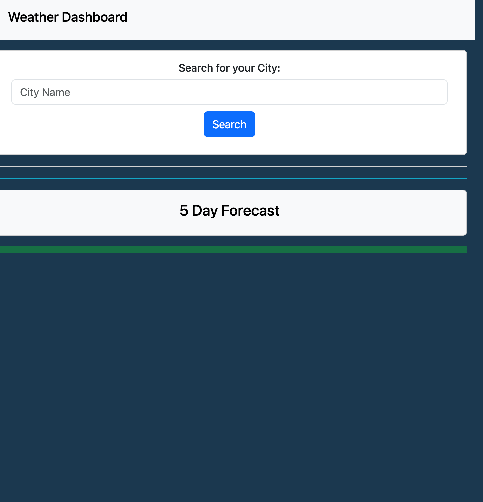
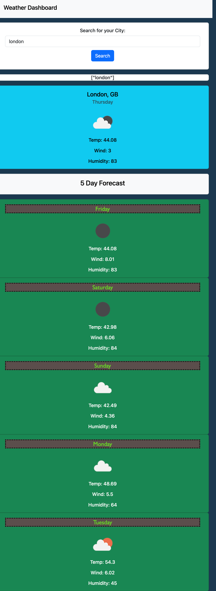
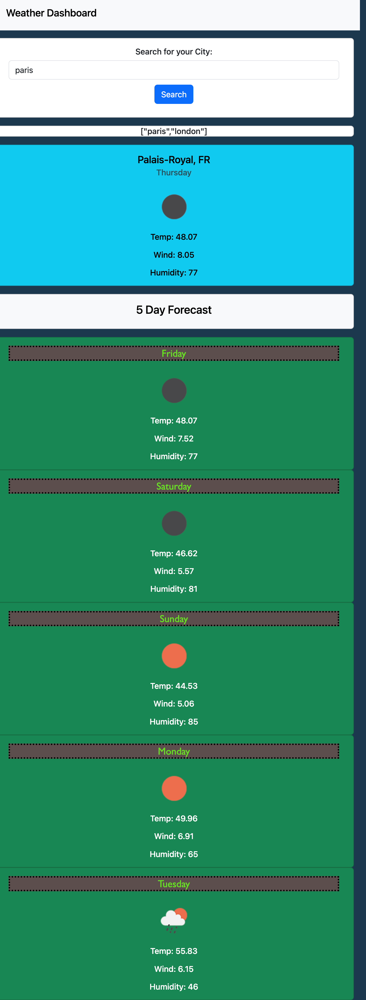

# weather-dashboard
Module 6: Server Side API's

## User Story

```
AS A traveler
I WANT to see the weather outlook for multiple cities
SO THAT I can plan a trip accordingly
```

## Acceptance Criteria

```
GIVEN a weather dashboard with form inputs
WHEN I search for a city
THEN I am presented with current and future conditions for that city and that city is added to the search history
WHEN I view current weather conditions for that city
THEN I am presented with the city name, the date, an icon representation of weather conditions, the temperature, the humidity, and the wind speed
WHEN I view future weather conditions for that city
THEN I am presented with a 5-day forecast that displays the date, an icon representation of weather conditions, the temperature, the wind speed, and the humidity
WHEN I click on a city in the search history
THEN I am again presented with current and future conditions for that city
```

## Usage


When visiting the webpage, the user will see 


After typing in a city, the page will display the current weather data for that city, along with a Five Day Forecast:


The user can continue to search for more cities, and the search history will appear on the page:


## Known Bugs
Currently, the search history appears, but in an array and not as a link to the search. Sometimes, after a few searches, the page will not load a new search. 

## Credits
Code for getting the current day of week: https://www.w3schools.com/jsref/tryit.asp?filename=tryjsref_date_weekday